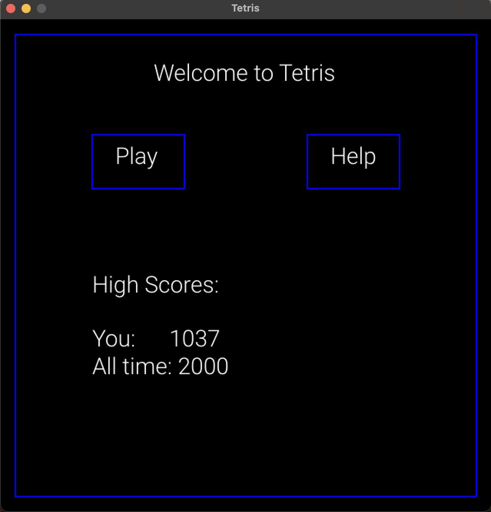
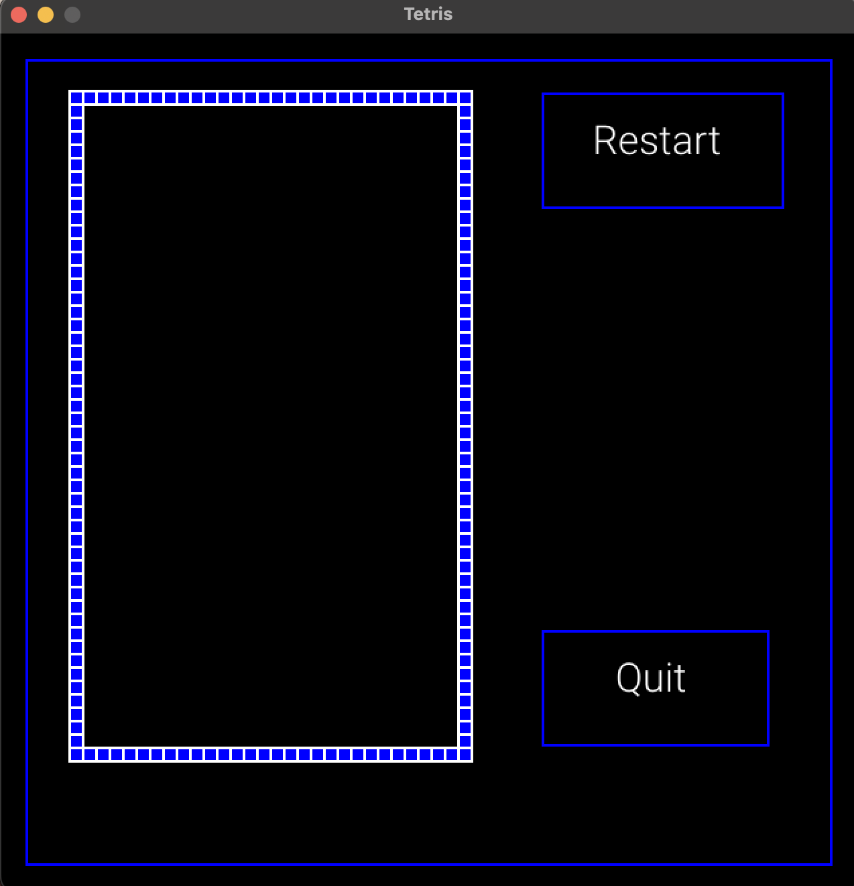

# Tetris Game in Go
### Warning: Incomplete, just not fully-functional POC

## Overview
This Tetris game is a modern implementation of the classic puzzle game. Written in Go and leveraging the Ebiten 2D game library, it offers a customizable and enjoyable gaming experience. The game includes features such as rotating, moving, and speeding up tetrominos, as well as a debug mode for development purposes.

## Requirements
- Go (version 1.14 or later)
- Ebiten v2 library
- OpenType font package
- errgroup package (golang.org/x/sync/errgroup)
- X/Image font package (golang.org/x/image/font)

## Installation

1. Clone the repository:
   ```bash
   git clone [repository URL]
2. Navigate to the game directory:

    ```bash
    cd [game directory]
3. Install dependencies:
    ```bash
    go get -u github.com/hajimehoshi/ebiten/v2

## Configuration
The game configuration can be modified through the config.json file. This includes settings like font type, size, and game-specific parameters.
```bash
{
  "Face": {
    "size": 30,
    "font": "RobotoLight"
  },
  "HistoryPlay": {
    "highest": 0, # doesn't update yet
    "you": 0 # doesn't update yet
  }
}
```

## Running the Game
Execute the following command in the game directory to run the game:
```bash
make run # run fairly sturdy portion of the game
make run-debug # run bugged portion of the game, hehe
make run-debug-ff # run bugged portion of the game, with some very-unstable featureflags
```

## Features 
mostly TODO
1. Basic Gameplay: Move, rotate, and speed up tetrominos as they fall.
2. Scoring System: Earn points by clearing lines.
3. Game Over: The game ends when tetrominos stack up to the top. 
4. Debug Mode: Run the game in a special debug mode for development and testing.

## Running in safe mode
Starting the game


On play


[game not complete]